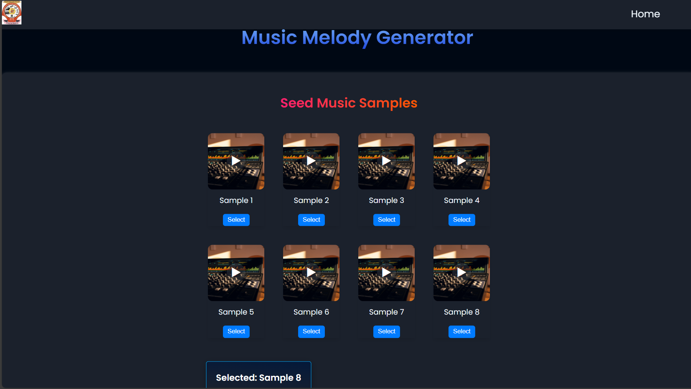

# MIDI-based AI Melody Generation for Expressive Music Synthesis 🎵🤖

This project automates **melody generation using deep learning**.  
It learns musical patterns from MIDI files and generates new monophonic melodies — enabling users to **create and listen to AI-composed music**.

🚀 Built as part of a **machine learning project on sequence modeling and generative AI**.  
Achieved **78% accuracy** in monophonic melody synthesis using a two-layer LSTM model.


## 📌 Problem Statement
Manual music composition is time-consuming and requires musical expertise.  
This project aims to **automate melody creation** by:
- Learning musical structure from MIDI data
- Generating coherent and expressive melodies
- Providing an interactive platform for AI-generated music


## 🔧 Key Highlights
- ✅ **MIDI dataset preprocessing** → Parsed, cleaned, and encoded MIDI files
- ✅ **Two-layer LSTM model** → Captured temporal dependencies in melodies
- ✅ **Temperature-based sampling** → Controlled creativity during generation
- ✅ **Hyperparameter tuning** → Improved stability and melody consistency
- ✅ **End-to-end system** → Model integrated with a Django web interface


## 🛠️ Tech Stack
- **Python**
- **Deep Learning (LSTM)**
- **MIDI Processing**
- **TensorFlow / Keras**
- **Django**
- **HTML / CSS**


## 📊 Results
- Achieved **78% accuracy** in monophonic melody synthesis
- Generated musically coherent MIDI sequences
- Enabled real-time melody generation and playback via web interface


## 🎵 Demo



## 🚀 How to Run
```bash
# Clone repository
git clone https://github.com/yourusername/AI-Music-Generation-LSTM.git
cd AI-Music-Generation-LSTM

# Install requirements
pip install -r requirements.txt

# Train the model (optional)
python train.py

# Run Django application
python manage.py runserver
